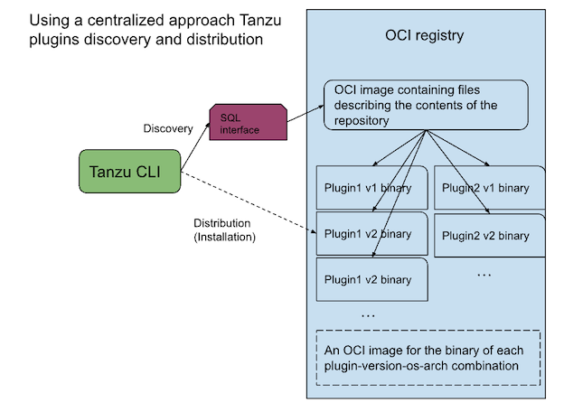

# Centralized Plugin Discovery and Distribution

The Tanzu CLI uses a system of plugins to provide functionality to interact
with different Tanzu products. Plugins are stored and discovered from
"plugin discovery sources".

To install a plugin, the CLI uses an OCI discovery source, which contains
the inventory of plugins including metadata for each plugin. This plugin inventory
also includes the location from which a plugin's binary can be downloaded.

The below figure illustrates such an OCI discovery.

## Plugin Binary Storage

The above figure depicts a joint approach to Discovery and Distribution of
plugins, where the plugin binaries are stored in the same OCI registry as the
the plugin inventory. However, such a co-location is not technically
required, and the plugin binaries could be stored in a separate OCI registry.

## Plugin Inventory Database

The inventory of plugins is stored in an SQLite database file, which in turn is
stored as an OCI image in the OCI registry. When the Tanzu CLI needs to obtain
information on available plugins, be it for the `tanzu plugin search` command
to list plugins to the user, or for the `tanzu plugin install` command to
actually obtain information to install a plugin, the CLI does the following:

1. [Verify the signature of the OCI image](../proposals/secure-plugin-installation-design.md) containing the SQLite DB file, and if successful,
1. Pull the OCI image, extracting at the same time the SQLite DB file.

The CLI then uses SQLite queries to obtain the desired information about one
or more plugins. Using that information, the CLI can either list plugins to the
user, or proceed to install plugins.

### Plugin Groups

Plugin groups define a list of plugin/version combinations that are applicable
together. Plugin groups aim to facilitate an efficient installation of sets of
plugins that pertain to a particular product that a user wants to interact with.

Plugin groups are stored in the same SQLite DB as plugins and the CLI proceeds
in the same fashion to obtain plugin group information for the
`tanzu plugin group search` and `tanzu plugin install --group <groupName>:<groupVersion>`
commands.

### SQlite database schemas

The database schema used for the plugin inventory and the one for the plugin
group inventory can be seen in the `pkg/plugininventory/data/sqlite/create_tables.sql`
file within this repository.
